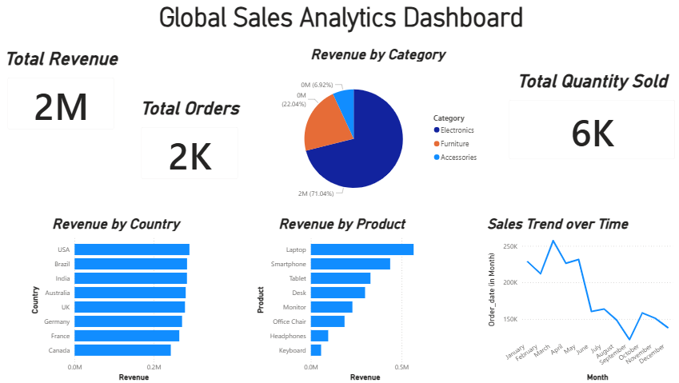
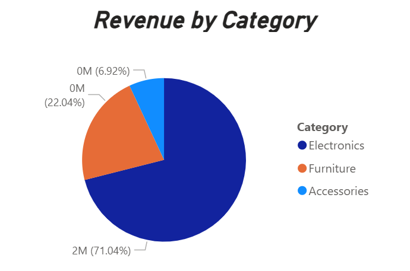
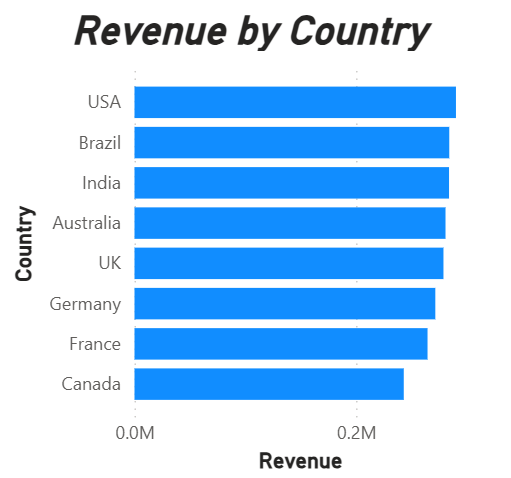
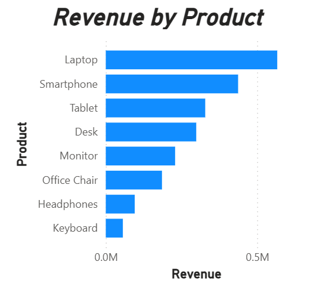
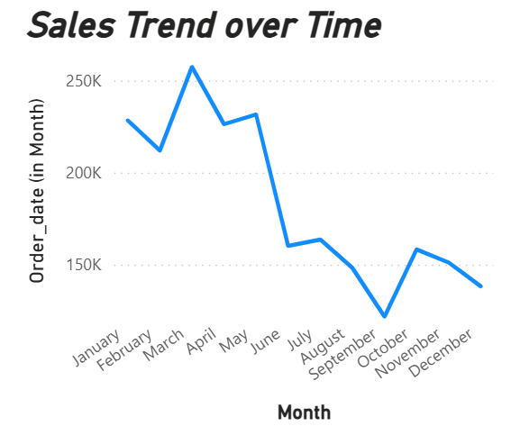

# 📊 Global Sales Analytics Project

## 🔹 Overview

This project analyzes global sales data to uncover key insights, trends, and business opportunities.
It combines Python-based data analysis with an interactive Power BI dashboard for better decision-making.

---

## 🔹 Tools & Technologies Used

* Python (Pandas, Matplotlib, Seaborn)
* Power BI
* Excel

---

## 🔹 Key Insights

* 📌 Top performing products and categories
* 🌍 Country-wise sales performance
* 📈 Sales trends over time
* 💰 Revenue distribution analysis

---

## 🔹 Project Structure

* `python-analysis/` → Data analysis using Jupyter Notebook
* `dataset/` → Sales dataset
* `dashboard/` → Power BI dashboard
* `images/` → Visualizations and charts

---

## 🔹 Dashboard Preview

---

## 🔹 Key Visualizations

---

## 🔹 How to Use

1. Open the Jupyter Notebook for analysis
2. Explore the dataset
3. Open Power BI file for interactive dashboard

---

## 🔹 Author

Garv Miglani
